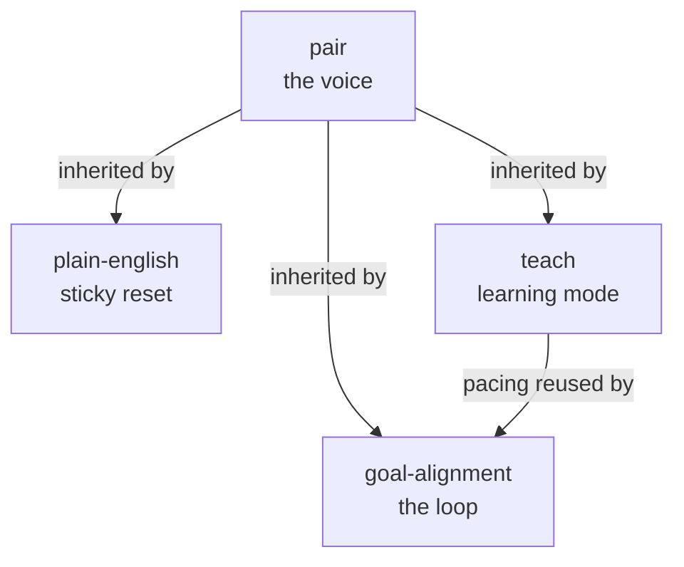

# Architect in the Loop

A small set of [Claude Code](https://www.claude.com/product/claude-code) skills for staying the architect while an agent does the work.

The bet: coding agents are strongest when a human does the thinking up front and hands the agent a tightly scoped, independently checkable loop. You stay the architect. The agent runs in the loop.

## The skills

**`pair`** — the voice. How the agent talks to you: conclusion first, ruthlessly brief, no AI tells, honest about what it did and didn't verify. The foundation the others build on.

**`plain-english`** — the sticky reset. When the agent drifts long or starts sounding like AI, one word (*"less text"*, *"plain english"*) snaps it back to `pair`'s budget and keeps it there for the rest of the session, not just the next reply.

**`teach`** — learning mode. One concept per message, anchored to real code, one diagram extended in place instead of fresh walls of prose, and it backs up the moment you're lost.

**`goal-alignment`** — the loop. Do all the deciding and proving *before* the loop starts, co-write a plain-english brief (Problem, Implementation, Verification), then hand the agent a self-correcting loop whose only completion criteria are checks that actually land in the transcript. Preparation is the product; the loop is the cheap part.

## How they fit together

`pair` is the foundation: the voice and working rules every reply obeys. `teach`, `plain-english`, and `goal-alignment` inherit it, and `goal-alignment` also reuses `teach`'s pacing whenever it has to explain code mid-design.



## Why "in the loop"

Two readings, both intended. The agent runs *in a loop*, a condition re-graded every turn by an independent grader until it's met. And you, the human, stay *in the loop*: you do the architecture, resolve every decision, and prove the runway before a single turn runs. `goal-alignment` exists to make both true at once.

## Using them

These are plain Claude Code skills. Copy the folders into your skills directory:

```sh
cp -r skills/pair skills/teach skills/goal-alignment ~/.claude/skills/
```

Then invoke by name (*"align the goal"*, *"walk me through X"*) or let Claude pick them up by their descriptions. `pair` is the always-on voice; `teach` and `goal-alignment` layer on top of it.

## Notes

Distilled from a personal working setup and deliberately kept generic. The value is in the shape, not the exact phrasing, so adapt the wording to your own taste and stack.

## License

MIT. See [LICENSE](LICENSE).
