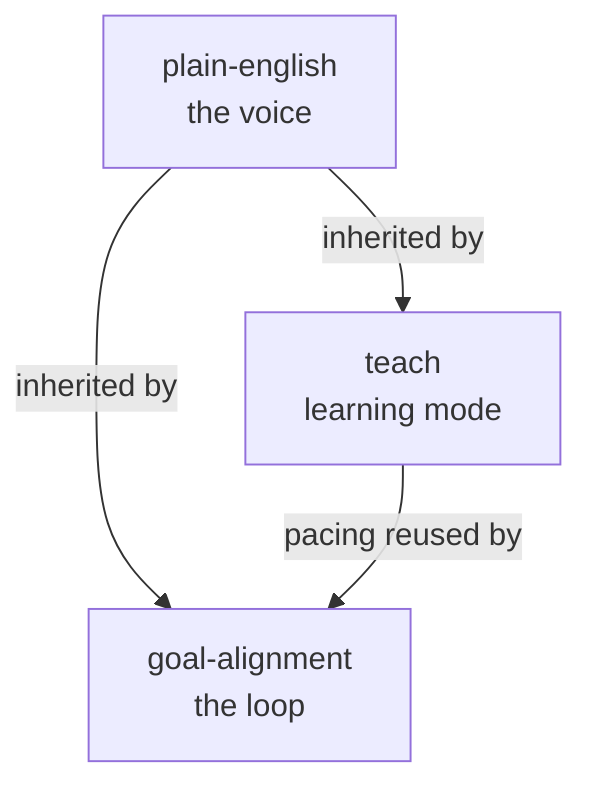

# Architect in the Loop

A small set of [Claude Code](https://www.claude.com/product/claude-code) skills for staying the architect while an agent does the work.

The bet: coding agents are strongest when a human does the thinking up front and hands the agent a tightly scoped, independently checkable loop. You stay the architect. The agent runs in the loop.

## The skills

**`plain-english`**: the voice. How the agent talks to you on every reply: high-school level language, short sentences with one fact each, no AI tells, honest about what it did and did not check. Say *"less text"* or *"high-school language"* once and the tighter style holds for the rest of the session. The foundation the others build on.

**`teach`**: learning mode. One concept per message, anchored to real code, one diagram extended in place instead of fresh walls of prose, and it backs up the moment you're lost.

**`goal-alignment`**: the loop. Do all the deciding and proving *before* the loop starts, co-write a plain-english brief (Problem, Implementation, Verification), then hand the agent a self-correcting loop whose only completion criteria are checks that actually land in the transcript. Preparation is the product; the loop is the cheap part.

## How they fit together

`plain-english` is the foundation: the voice and working rules every reply obeys. `teach` and `goal-alignment` inherit it, and `goal-alignment` also reuses `teach`'s pacing whenever it has to explain code mid-design.


```mermaid
flowchart TD
    plain["plain-english<br/>the voice"]
    teach["teach<br/>learning mode"]
    goal["goal-alignment<br/>the loop"]
    plain -->|inherited by| teach
    plain -->|inherited by| goal
    teach -->|pacing reused by| goal
```

## Why "in the loop"

Two readings, both intended. The agent runs *in a loop*, a condition re-graded every turn by an independent grader until it's met. And you, the human, stay *in the loop*: you do the architecture, resolve every decision, and prove the runway before a single turn runs. `goal-alignment` exists to make both true at once.

## Using them

### Option 1: Install as a Claude Code Plugin (Recommended)

You can install these skills as a local Claude Code plugin directly from your cloned directory:

```sh
claude plugin install /path/to/architect-in-the-loop
```

Alternatively, you can test it temporarily in a single Claude Code session:

```sh
claude --plugin-dir /path/to/architect-in-the-loop
```

### Option 2: Copy Manual Skills

If you prefer to install them manually as individual skills, copy the folders into your skills directory:

```sh
cp -r skills/plain-english skills/teach skills/goal-alignment ~/.claude/skills/
```

### Invocation

Then invoke by name (*"align the goal"*, *"walk me through X"*) or let Claude pick them up by their descriptions.

`plain-english` is meant to be always on. To load it in every session, import it from your `~/.claude/CLAUDE.md`:

```
@/path/to/architect-in-the-loop/skills/plain-english/SKILL.md
```

It sets the reading level and the wording. It sets no length budget of its own, so it works well next to Claude Code's Concise output style.

### Your resources file

The skills never name a host, a tracker, a page id or a customer. Those live in one file on your machine, `.agents/resources.mdc`, which the agent finds by walking up from the working directory. Start from the template:

```sh
mkdir -p ~/your-workspace/.agents
cp skills/plain-english/resources-template.mdc ~/your-workspace/.agents/resources.mdc
```

Fill it in and keep it out of any public repo.

## Notes

Distilled from a personal working setup and deliberately kept generic. The value is in the shape, not the exact phrasing, so adapt the wording to your own taste and stack.

## License

MIT. See [LICENSE](LICENSE).
