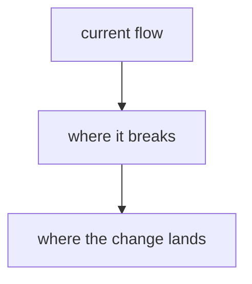

# {short name} — round {N}



## Problem

What is broken or missing, in plain english, and how to observe it so "fixed" is checkable. For a fix-round: name the prior round's brief and the single functional gap it left open. Scope to that gap only, nothing wider.

## Implementation

- **Decisions made:** every open decision, one line each with its resolution, so the loop inherits zero.
- **How it lands:** order and why, commit strategy, what stays unchanged and what is explicitly untouched.
- **Hygiene:** minimal diff; a comment only where it states a constraint the code cannot show.

## Verification

### Prerequisites (gate before the loop; not a layer)

- `<health command per touched service>` → `<green signal>`
- Client-UI reachability: load the real UI a user touches, sign in, reach the exact surface.

### Layers (renumbered from 1, cheapest-feedback-first)

1. **seam:** `<the seam this covers>` — **catches:** `<failure class>` — **run:** `<exact command>` — **proof:** `<rendered UI result + backend signal>`
2. ...

### Critic gate (mandatory, fresh context)

A context window that did not write the code reviews the diff and the verification, runs the laziness attack list (hardcoded config, swallowed errors, weakened tests, leftover stubs, slop comments, local workarounds), and POSTs every finding with its disposition (fix diff shown, or rebuttal).

## Binary completion

All layers green and demonstrated user-visibly + every critic finding dispositioned + any human follow-up noted.

## Compiled loop condition

```
/goal <prerequisites as a turn-1 gate> ... done means all of: <verification layers as binary
proofs> + <critic gate posted>; <constraint that must not change>; or stop after {N} turns.
```
